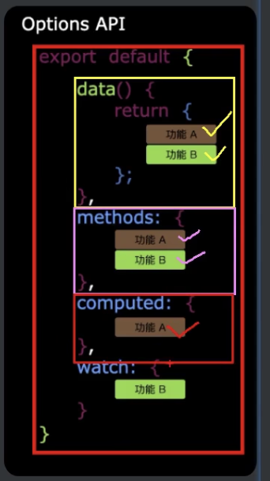
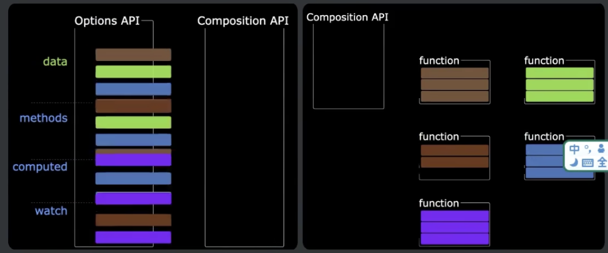

Vue3中同样支持vue2的语法。

Vue2的API设计是Options（配置）风格的。
VUe3的API设计是Composition（组合）风格的。

## Options API的弊端：
Options类型的API，数据，方法，计算属性等，是分散在：data，methods，computed等配置项里的，若想新增或者修改一个需求，
就需要分别修改：data，methods，computed，不便于维护和复用。  

## Composition API的优势
可以通过函数的方式，更加优雅的组织代码，让相关功能的代码更加有序的组织在一起。  
